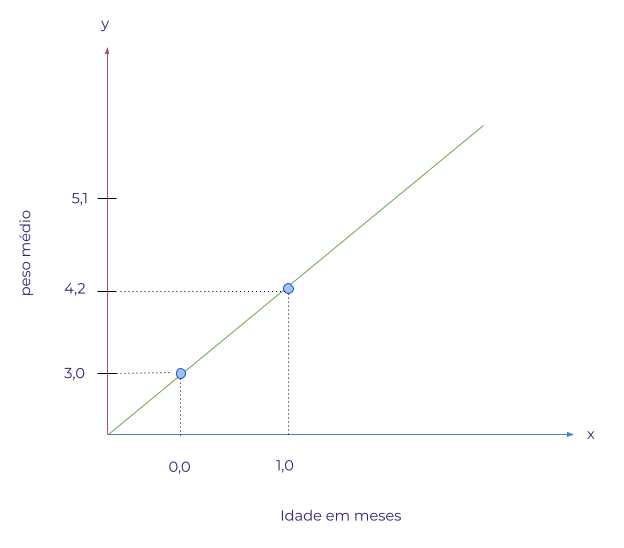
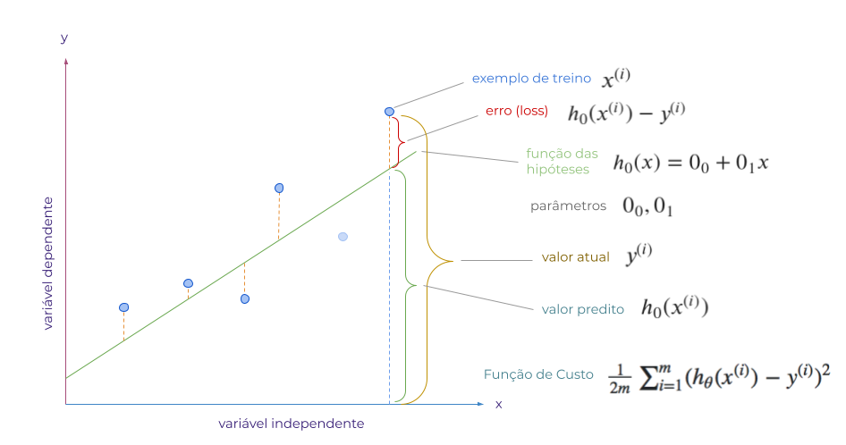
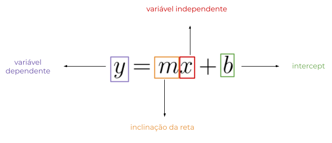
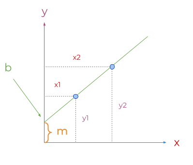

## REGRESSÃO

Regressão é uma forma estatística de análise de dados. O termo regressão foi utilizado pela primeira vez por Sir Francis Galton, por volta de 1880, para denotar a regressão à média da população observada. Em estatística a *Regressão à Média* trata de como os dados se equilibram, isto é, se uma variável for extrema na primeira vez que for medida, ela estará mais próxima da média na próxima vez que for medida.     

Analisamos um conjunto de dados com a finalidade de entender o comportamento dos dados e como estes estão organizados. Um conjunto de dados estruturado, isto é, organizado em linhas e colunas por exemplo é formado por grupos de informações que identificam algumas características desse conjunto de dados. Tomemos como exemplo uma tabela com duas colunas sendo uma a idade e a outra o peso de uma criança recém nascida:

|idade em meses| peso médio em kg|
|--------------|-----------------|
|0             | 3,2             |
|1             | 4,2             |
|2             | 5,1             |
|3             | 5,8             |
|4             | 6,4             |
|5             | 6,9             |  

Ao analisar a tabela de dados é possível verificar que a medida que a idade da criança aumenta o peso também aumenta, indicando que há uma relação entre os valores das colunas. É importante no entanto observar que é a idade que varia definindo o peso e não o contrário. Tomando essa relação como exemplo, podemos dizer que há uma depêndencia entre os dados das colunas.  

### Variáveis dependentes e independentes

Na tabela de exemplo podemos dizer que cada uma das colunas é uma variável, ou seja, a variável *peso* e a variável *idade*, onde a variável peso é dependente da variável idade. Dessa forma se a idade aumenta, teremos da mesma forma um aumento no peso.  
Uma variável dependente normalmente é representada pela letra *y* em um gráfico e a variável independente é expressa por *x*, como podemos ver no gráfico a seguir.

### Regressão Linear

Ao observermos a linha verde percebemos que há dois pontos na cor azul que representam a relação entre as variáveis *peso médio* e *idade em meses*. Podemos notar que a medida que o valor da variável *y* aumenta, temos também o aumento do valor da variável *x*. Essa relação representada pela linha verde, entre as duas variáveis é chamada de **linear**, uma vez que pode ser expressa por meio de uma linha reta. De forma geral quando duas variáveis aumentam ou diminuem simultaneamente temos então uma regressão linear.

### Regressão Linear Simples

Quando temos uma relação entre apenas duas variáveis, uma dependente e outra independente dizemos que a regressão é do tipo simples. Em nosso exemplo, a variável *y* (peso médio) é explicada pela variável *x* (idade em meses), configurando assim uma regressão linear simples. Essa relação pode ser do tipo *positiva* ou *negativa*.

**Relação Linear Positiva:** quando uma variável aumenta e a outra também aumenta, temos uma relação linear positiva.

**Relação Linear Negativa:** quando uma variável aumenta e a outra diminui, temos uma relação linear negativa.   

### Cálculo da Regressão Linear

Quando aplicamos uma regressão linear em um conjunto de dados, estamos tentando prever o valor de *y* em função de *x*. Cada previsão é resultado de um cálculo que busca ajustar valores a fim de traçar uma reta que melhor se ajuste aos dados, tendo um erro mínimo. Esse processo de ajuste dos valores que definem o posicionamento da reta sobre os dados é interativo, repetindo-se quantas vezes for necessário para obtenção de um melhor valor. Para entender como é feito esse cálculo precisamos dividir todo esse processo em partes menores, por isso vamos analisar um gráfico com algumas informações relacionadas ao cálculo da regressão e em seguida vamos nos deter em algumas partes.

 

 
No gráfico apresentado cada ponto azul é um exemplo de treino, é o dado que estamos apresentando para o nosso modelo a fim de obter uma previsão, esta previsão é definida pela *função de hipótese*. Partindo do pressuposto que o modelo não acerte o valor de previsão na primeira iteração, temos então uma diferença entre o valor atual e o valor predito, essa diferença é o que chamamos de *erro ou loss*. Para o cálculo do erro utilizamos uma função denominada *função de custo*. Por fim temos os *parâmetros* que são os valores que serão alterados e ajustados durante todo o processo de treinamento do modelo. A seguir vamos passar por cada um desses itens a fim de entendermos como é feito o ajuste dos parâmetros durante o treinamento, mas antes de prosseguirmos para uma explicação mais detalhada precisamos saber o que é a **esquação da reta**.

### Equação da Reta  
 

Estar familiarizados antes com a *equação da linha reta*, é um bom começo para entendermos como funciona a *função de custo*, então vamos conhecer alguns aspectos da equação da reta, que pode ser descrita do seguinte modo:
    
 

 

Através da equação da reta podemos definir como uma reta será traçada em um gráfico. A letra *y* define um valor no eixo vertifical, que no contexto de machine learning pode ser chamada de variável dependente conforme vimos anteriormente, da mesma forma que a letra *x* é o valor do eixo horizontal ou variável independente. A letra *m* diz respeito ao valor de inclinação da reta, e a letra *b* indica o ponto em que a linha cruza ou intercepta a linha vertical no gráfico. A imagem a seguir ilustra a função de cada elemento da equação na representação de uma linha reta no gráfico.

 

 

Ao substituírmos cada elemento da equação da reta, definimos como a linha deve ser apresentada no gráfico. Caso o valor de *b*, seja zero a linha cruzará o eixo *y* no ponto zero.  

#### COEFICIENTE DE CORRELAÇÃO DE PEARSON

É um teste que mede a relação estatística, entre duas variáveis continuas. O coeficiente de correlação de Pearson pode ter um intervalo de valores +1 e -1. Um valor zero(0), indica que não há associação entre as variáveis.

#### RELAÇÃO LINEAR FRACA OU INEXISTENE

Quando temos valores muito dispersos no gráfico ao traçarmos uma linha, identificamos que os valores estão muito longe da linha. Nesse caso a correlação pode ser muito fraca ou inexistente.

#### FUNÇÃO DE CUSTO

A diferença entre os valores previstos e a verdade fundamental. Para isso elevamos ao quadrado a diferença do erro, somamos todos os pontos de dados e dividimos esse valor pelo número total de pontos de dados.

