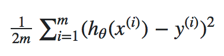

## REGRESSÃO

Regressão é uma forma estatística de análise de dados. O termo regressão foi utilizado pela primeira vez por Sir Francis Galton, por volta de 1880, para denotar a regressão à média da população observada. Em estatística a *Regressão à Média* trata de como os dados se equilibram, isto é, se uma variável for extrema na primeira vez que for medida, ela estará mais próxima da média na próxima vez que for medida.     

Analisamos um conjunto de dados com a finalidade de entender o comportamento dos dados e como estes estão organizados. Um conjunto de dados estruturado, isto é, organizado em linhas e colunas por exemplo é formado por grupos de informações que identificam algumas características desse conjunto de dados. Tomemos como exemplo uma tabela com duas colunas sendo uma a idade e a outra o peso de uma criança recém nascida:

|idade em meses| peso médio em kg|
|--------------|-----------------|
|0             | 3,2             |
|1             | 4,2             |
|2             | 5,1             |
|3             | 5,8             |
|4             | 6,4             |
|5             | 6,9             |  

Ao analisar a tabela de dados é possível verificar que a medida que a idade da criança aumenta o peso também aumenta, indicando que há uma relação entre os valores das colunas. É importante no entanto observar que é a idade que varia definindo o peso e não o contrário. Tomando essa relação como exemplo, podemos dizer que há uma depêndencia entre os dados das colunas.  

### Variáveis dependentes e independentes

Na tabela de exemplo representada cada coluna representa uma variável, onde a variável *peso* é dependente da variável *idade*. Dessa forma se a idade aumenta, teremos da mesma forma um aumento no peso.  
Uma variável dependente normalmente é representada pela letra *y* em um gráfico e a variável independente é expressa por *x*, como podemos ver no gráfico a seguir.

### Regressão Linear

A linha verde presente na imagem anterior representa a relação entre as variáveis *peso médio* e *idade em meses*. A medida que o valor da variável *y* aumenta, aumenta também valor da variável *x*. Essa relação representada pela linha verde, entre as duas variáveis é chamada de **linear**, uma vez que pode ser expressa por meio de uma linha reta. De forma geral quando duas variáveis aumentam ou diminuem simultaneamente temos então uma regressão linear.

### Regressão Linear Simples

Uma é linear simples quando há uma relação entre apenas duas variáveis, uma dependente e outra independente. Na tabela de exemplo, a variável *y* (peso médio) é explicada pela variável *x* (idade em meses), configurando assim uma regressão linear simples. Essa relação pode ser do tipo *positiva* ou *negativa*.

**Relação Linear Positiva:** quando uma variável aumenta e a outra também aumenta, temos uma relação linear positiva.

**Relação Linear Negativa:** quando uma variável aumenta e a outra diminui, temos uma relação linear negativa.   

### Cálculo da Regressão Linear

A aplicação de um modelo de regressão linear em um conjunto de dados tem como objetivo prever o valor de *y* em função de *x*. Cada previsão é resultado de um cálculo que busca ajustar valores a fim de traçar uma reta que melhor se ajuste aos dados, tendo um erro mínimo. Esse processo de ajuste dos valores que definem o posicionamento da reta sobre os dados é iterativo, repetindo-se quantas vezes for necessário para obtenção de um melhor valor.

 

 
Os pontos azuis presentes no gráfico representam os exemplos de treinos, ou seja, é o dado que é apresentando para nosso modelo a fim de obter uma previsão, esta previsão é definida pela *função de hipótese*. 
A dirença entre o valor esperado ou real e o valor da previsão ou hipótese é o valor do *erro* ou *loss*.
A *função de custo* é a função utilizada para calcular o erro. 
Por fim os parâmetros são os valores que serão alterados e ajustados durante o processo de treino.

 
 

### Equação da Reta  
 

A *equação da linha reta*, é a equação utilizada para calcular o posicionamento de uma linha reta em um gráfico. Estar familiarizado com a equação da reta é um bom começo para entendermos como funciona a *função de custo*.
    
 

 

A equação da reta define como uma reta será traçada em um gráfico. A letra *y* define um valor no eixo vertifical, que no contexto de machine learning pode ser chamada de variável dependente, da mesma forma, a letra *x* é o valor do eixo horizontal ou variável independente. A letra *m* diz respeito ao valor de inclinação da reta, e a letra *b* indica o ponto em que a linha cruza ou intercepta a linha vertical no gráfico. A imagem a seguir ilustra a função de cada elemento da equação na representação de uma linha reta no gráfico.

 

 

### Função de Custo
 

Uma função de custo mapeia um evento ou valores de uma ou mais variáveis em um número real que representa intiutivamente algum custo associado ao evento, que neste cenário é a diferença entre os valores estimados ou hipótese e os valores reais.  
A função de custo é representada do seguinto modo:

 

 

Na função de custo a letra *m* representa o número de amostras, o símbolo a seguir é o *sigma* **&#8721;** que diz que o cálculo a direita deve ser repetido de *i* até *m*, isto é, o cálculo deve ser repetido para cada amostra. O cálculo a ser repetido é o cálculo do valor da hipótese h0(x ( i )) menos o valor real *y*. O processo será repetido iterativamente até o último elemento da amostra. O resultado final será um único resultado, cujo valor seja o menor que consiste no menor custo, indicando assim a hipótese com menor custo.

#### COEFICIENTE DE CORRELAÇÃO DE PEARSON

É um teste que mede a relação estatística, entre duas variáveis continuas. O coeficiente de correlação de Pearson pode ter um intervalo de valores +1 e -1. Um valor zero(0), indica que não há associação entre as variáveis.

#### RELAÇÃO LINEAR FRACA OU INEXISTENE

Quando temos valores muito dispersos no gráfico ao traçarmos uma linha, identificamos que os valores estão muito longe da linha. Nesse caso a correlação pode ser muito fraca ou inexistente.

#### FUNÇÃO DE CUSTO

A diferença entre os valores previstos e a verdade fundamental. Para isso elevamos ao quadrado a diferença do erro, somamos todos os pontos de dados e dividimos esse valor pelo número total de pontos de dados.

