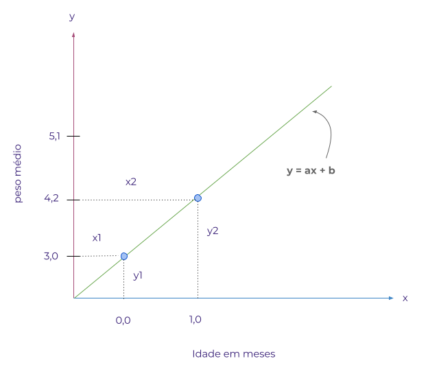
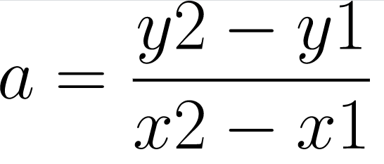
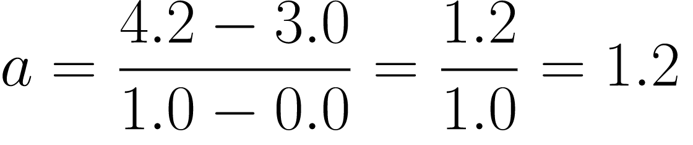

## REGRESSÃO

Regressão é uma forma estatística de análise de dados. O termo regressão foi utilizado pela primeira vez por Sir Francis Galton, por volta de 1880, para denotar a regressão à média da população observada. Em estatística a *Regressão à Média* trata de como os dados se equilibram, isto é, se uma variável for extrema na primeira vez que for medida, ela estará mais próxima da média na próxima vez que for medida.     

Analisamos um conjunto de dados com a finalidade de entender o comportamento dos dados e como estes estão organizados. Um conjunto de dados estruturados, isto é, organizado em linhas e colunas por exemplo é formado por grupos de informações que identificam algumas características desse conjunto de dados. Tomemos como exemplo uma tabela com duas colunas sendo uma a idade e a outra o peso de uma criança recém nascida:

|idade em meses| peso médio em kg|
|--------------|-----------------|
|0             | 3,2             |
|1             | 4,2             |
|2             | 5,1             |
|3             | 5,8             |
|4             | 6,4             |
|5             | 6,9             |  

### Variáveis dependentes e independentes  

Ao analisar a tabela de dados é possível verificar que a medida que a idade da criança aumenta o peso também aumenta, indicando que há uma relação entre os valores das colunas. É importante no entanto observar que é a idade que varia definindo o peso e não o contrário. Tomando essa relação como exemplo, podemos dizer que há uma depêndencia entre os dados das colunas.  

Cada uma dessas colunas são chamadas de variáveis, ou seja, a variável *peso* e a variável *idade*, onde a variável peso é dependente da variável idade. Dessa forma se a idade aumenta, teremos da mesma forma um aumento no peso.  
Uma variável dependente normalmente é representada pela letra *y* em um gráfico e a variável independente é expressa por *x*, como podemos ver no gráfico a seguir.

### Regressão Linear

Ao observermos a linha verde percebemos que há dois pontos na cor azul que representam a relação entre as variáveis *peso médio* e *idade em meses*. Podemos notar que a medida que o valor da variável *y* cresce também o valor da variável *x*. Essa relação representada pela linha verde, entre as duas variáveis é chamada de **linear**, uma vez que pode ser exprimida por meio de uma linha reta. De forma geral quando duas variáveis aumentam ou diminuem simultaneamente temos então uma regressão linear.

### Regressão Linear Simples

Quando temos uma relação entre apenas duas variáveis, uma dependente e outra independente dizemos que a regressão é do tipo simples, uma vez que uma variável dependente, isto é o *y* (peso médio) esta sendo explicada pela independente, neste caso *x* (idade em meses). Uma regresão linear pode ter uma relação *positiva* ou *negativa*:

**Relação Linear Positiva:** quando uma variável aumenta e a outra também aumenta, temos uma relação linear positiva.

**Relação Linear Negativa:** quando uma variável aumenta e a outra diminui, temos uma relação linear negativa.   

### Equação Linear

Um modelo de **regressão linear** é uma equação  matemática que fornece uma relação linear entre duas variáveis *x* e *y*. Para entermos como o cálculo de um modelo funciona podemos começar explorando a fórmula da *equação linear* que pode ser escrita do seguinte modo:

*y = ax + b*

Onde:

- **y**: *é a variável dependente*
- **x**: *é a variável independente*
- **a**: *é a inclinação*
- **b**: *é o intercepto* 

Podemos utilizar o gráfico apresentado anteriormente para compreender a fórmula e substituir os valores para o cálculo da equação.
 

 
 

  

------------------------

#### COEFICIENTE DE CORRELAÇÃO DE PEARSON

É um teste que mede a relação estatística, entre duas variáveis continuas. O coeficiente de correlação de Pearson pode ter um intervalo de valores +1 e -1. Um valor zero(0), indica que não há associação entre as variáveis.

#### RELAÇÃO LINEAR FRACA OU INEXISTENE

Quando temos valores muito dispersos no gráfico ao traçarmos uma linha, identificamos que os valores estão muito longe da linha. Nesse caso a correlação pode ser muito fraca ou inexistente.

#### FUNÇÃO DE CUSTO

A diferença entre os valores previstos e a verdade fundamental. Para isso elevamos ao quadrado a diferença do erro, somamos todos os pontos de dados e dividimos esse valor pelo número total de pontos de dados.

